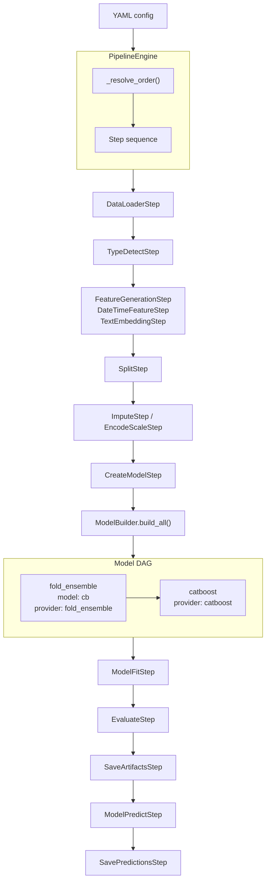

# mlcombine


[](LICENSE)
[](https://www.python.org/)


Декларативный Low-Code/No-Code фреймворк для ML-соревнований.
Всё, что нужно — YAML-конфиг. Остальное фреймворк берёт на себя.

```bash
pip install mlcombine
mlcombine train --config config.yaml
```

## Быстрый старт

Через `uv` (рекомендуется):

```bash
git clone https://github.com/your-org/mlcombine.git
cd mlcombine
uv sync --group dev
```

Через `pip`:

```bash
git clone https://github.com/your-org/mlcombine.git
cd mlcombine
pip install -e ".[dev]"
```

Запустить baseline на Titanic:

```bash
mlcombine train --config examples/configs/titanic_baseline.yaml
```

Или из Python:

```python
from mlcombine.core.pipeline import PipelineEngine
from mlcombine.core.schemas.config import MLCombineConfig
from mlcombine.core.types import PipelineContext

cfg = MLCombineConfig(**{
    "data": {
        "train_df": "train.csv",
        "test_df": "test.csv",
        "target_col": "Survived",
    },
    "model": [
        {"provider": "sklearn", "params": {"backbone": "gradient_boosting"}},
    ],
    "trainer": {"output_dir": "outputs", "output_file": "outputs/submission.csv"},
})
engine = PipelineEngine.from_config(cfg)
engine.run_all(PipelineContext())
```

---

## Документация

| Язык | |
|---|---|
| Русский | [README-RU.md](README-RU.md) · [config.yaml](docs/ru/config.md) · [Расширения](docs/ru/extensions.md) · [Архитектура](docs/ru/architecture.md) · [Слои PyTorch](docs/ru/layers.md) |
| English | [README.md](README.md) · [config.yaml](docs/en/config.md) · [Extensions](docs/en/extensions.md) · [Architecture](docs/en/architecture.md) · [PyTorch Layers](docs/en/layers.md) |

### Примеры YAML-конфигов

| Use-case | Файл |
|---|---|
| Базовый baseline (sklearn) | [titanic_baseline.yaml](examples/configs/titanic_baseline.yaml) |
| CV + Optuna-тюнинг | [tabular_cv.yaml](examples/configs/tabular_cv.yaml) |
| Ensemble CatBoost + LightGBM | [ensemble_blend.yaml](examples/configs/ensemble_blend.yaml) |
| PyTorch кастомная архитектура | [pytorch_layers.yaml](examples/configs/pytorch_layers.yaml) |
| Загрузка датасета по URL | [remote_data.yaml](examples/configs/remote_data.yaml) |

---

## Tech Stack

| Компонент | Технология |
|---|---|
| Конфигурация | `YAML` + `Pydantic v2` |
| CLI | `Click` |
| Табличные модели | `CatBoost`, `LightGBM`, `scikit-learn` |
| Нейросети | `PyTorch` (опционально) |
| Тюнинг | `Optuna` |
| Пайплайн | Собственный движок (BaseStep → PipelineEngine) |
| Типизация | `mypy --strict` |
| Тестирование | `pytest` |

---

## Project Structure

```
mlcombine/
├── src/mlcombine/
│   ├── cli/main.py              # Click CLI (train / predict)
│   ├── core/
│   │   ├── pipeline.py          # PipelineEngine + _BASE_ORDER + plugin loader
│   │   ├── builder.py           # ModelBuilder — топологическая сортировка DAG
│   │   ├── registry.py          # ExtensionRegistry (steps, providers, metrics...)
│   │   ├── types.py             # BaseStep, PipelineContext, PipelineData
│   │   ├── metric.py            # Встроенные метрики (f1, auc, rmse...)
│   │   ├── evaluator.py         # BaseArchitectureValidator ABC
│   │   ├── tensor/              # UnifiedTensor (numpy/torch адаптеры)
│   │   └── schemas/
│   │       ├── config.py        # MLCombineConfig, ModelNode, DataConfig...
│   │       ├── blueprint.py     # ModelBlueprint — ленивое построение модели
│   │       └── step_configs.py  # StepConfigs (extra="allow")
│   ├── models/
│   │   ├── providers/           # CatBoost, LightGBM, sklearn, PyTorch, hybrid
│   │   └── meta/                # ensemble, fold_ensemble, stacking, tuner, uplift
│   ├── steps/                   # 27 pipeline steps (load, fit, predict, evaluate...)
│   └── evaluators/              # cv.py, holdout.py
├── tests/                       # тесты
├── docs/                        # Документация (ru/en)
├── examples/configs/            # Примеры YAML-конфигов
└── pyproject.toml
```

---

## Architecture



### Как это работает

1. **PipelineEngine** читает YAML, загружает плагины, резолвит порядок шагов
2. Каждый шаг — `BaseStep` с флагами `train`/`predict`, чтобы train и predict пайплайны могли различаться
3. **ModelBuilder** строит DAG моделей: листовые провайдеры (CatBoost, sklearn) + meta-провайдеры (ensemble, stacking, fold_ensemble, tuner)
4. Все зависимости между нодами разрешаются через `id` → `model`/`models` ссылки
5. На predict запускаются только шаги с `predict=True`, артефакты загружаются с диска

### Pipeline Steps (порядок по умолчанию)

```
PrepareEnvironment → PrepareDataset → DataLoader → TypeDetect → FeatureGeneration →
LoadArtifacts → Split → Impute → EncodeScale → CreateModel → ModelFit →
Evaluate → SaveArtifacts → AlignFeatures → ModelPredict → DropTargetColumns → SavePredictions
```

Шаги можно переопределить через `pipeline.order` или добавить свои через `@registry.step()` с `before`/`after`.

---

## Configuration

### Базовый baseline

```yaml
# titanic_baseline.yaml
data:
  train_df: "train.csv"
  test_df: "test.csv"
  target_col: "Survived"
  task_type: classification
model:
  - provider: "sklearn"
    params:
      backbone: "gradient_boosting"
trainer:
  output_dir: outputs
  output_file: outputs/submission.csv
```

### CatBoost + Fold Ensemble

```yaml
model:
  - id: "cb"
    provider: "catboost"
    params:
      iterations: 5000
      depth: 10
      learning_rate: 0.07
  - provider: "fold_ensemble"
    model: "cb"
    params:
      n_folds: 5
      stratified: true
```

### Ensemble CatBoost + LightGBM

```yaml
model:
  - id: "cb"
    provider: "catboost"
    params: { iterations: 3000, depth: 8 }
  - id: "lgb"
    provider: "lightgbm"
    params: { num_iterations: 3000, max_depth: 8 }
  - provider: "ensemble"
    models: ["cb", "lgb"]
    params:
      weights: [0.6, 0.4]
```

### Optuna Tuning

```yaml
model:
  - provider: "tuner"
    params:
      n_trials: 50
      target_provider: "catboost"
      target_params:
        iterations: 3000
      search_space:
        depth: { type: "int", low: 4, high: 10 }
        learning_rate: { type: "float", low: 0.01, high: 0.3, log: true }
```

---

## Model Providers

| Провайдер | Тип | Описание |
|---|---|---|
| `sklearn` | leaf | Random Forest, Gradient Boosting, SVM, Logistic Regression, MLP |
| `catboost` | leaf | CatBoost (GPU через `gpu: true`) |
| `lightgbm` | leaf | LightGBM |
| `pytorch` | leaf | Кастомные архитектуры через YAML-блоки |
| `hybrid` | leaf | Мультимодальный PyTorch (изображения + текст) |
| `ensemble` | meta | Взвешенное усреднение моделей (hard/soft vote) |
| `fold_ensemble` | meta | K-fold CV + усреднение fold-моделей |
| `stacking` | meta | Стекинг с meta-моделью (logistic/ridge), OOF-support |
| `tuner` | meta | Optuna hyperparameter search |
| `t_learner` / `s_learner` | meta | Uplift моделирование |

---

## Extending: Плагины

Любой шаг или провайдер можно добавить через plugin-систему.

### Custom Step

```python
# my_step.py
from mlcombine.core.registry import registry
from mlcombine.core.types import BaseStep, MLCombineConfig, PipelineContext

@registry.step("MyStep", before="TypeDetectStep")
class MyStep(BaseStep[PipelineContext]):
    train = True
    predict = True

    def __init__(self, cfg: MLCombineConfig, *, predict=False, weights=None):
        self._param = cfg.step_config.my_step.get("param", 42)

    def run(self, context: PipelineContext) -> PipelineContext:
        # мутируем context.data.train_df / test_df
        return context
```

Подключение в YAML:

```yaml
plugins: ["path/to/my_step.py"]
step_config:
  my_step:
    param: 100
```

### Custom Model Provider

```python
@registry.model_provider("my_model")
def my_provider(backbone=None, task_type=None, objective=None, **params):
    # params приходят из YAML + task_type/num_classes от ModelBuilder
    return MyModel(**params)
```

---

## Testing & Linting

```bash
# Тесты
python -m pytest tests/ -q
python -m pytest tests/ -q -m "not optuna"  # без медленных optuna-тестов

# Линтер
ruff check .

# Type checker
mypy --strict src

# Форматирование
ruff format .
```
